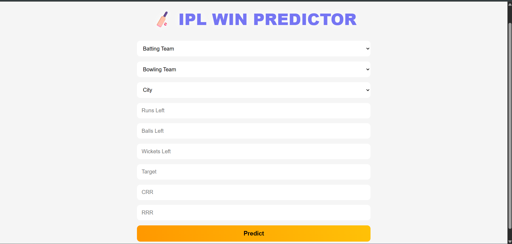
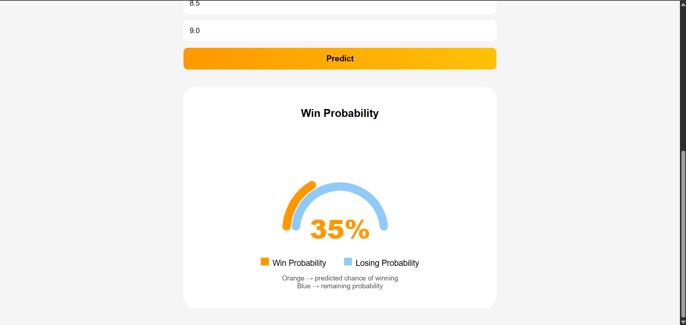
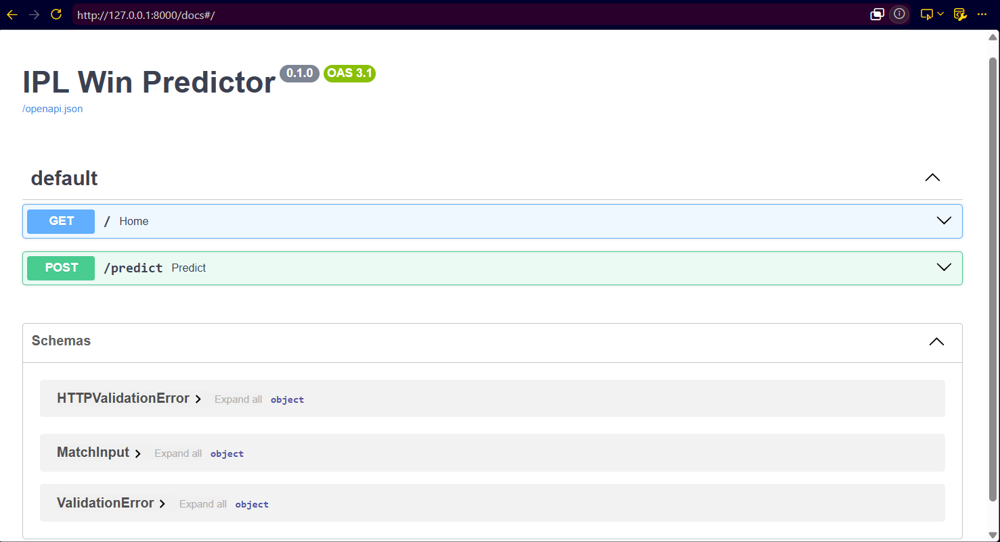

# 🏏 IPL Win Predictor

A full-stack Machine Learning application that predicts the **live win probability of an IPL match** during the second innings using match state information.

Inspired by Cricbuzz-style live prediction systems.

---

## 🚀 Live Demo

### Frontend

```text
https://ipl-win-predictor-omega-three.vercel.app/
```

### Backend API

```text
https://ipl-win-predictor-233z.onrender.com
```

### API Documentation

```text
https://ipl-win-predictor-233z.onrender.com/docs
```

---

# 📌 Project Overview

This project predicts the probability of the chasing team winning an IPL match based on the current match situation.

Instead of predicting only the final result, the model estimates **live winning chances** throughout the innings.

Example:

| Batting Team | Bowling Team | Runs Left | Balls Left | Wickets Left |
| ------------ | ------------ | --------- | ---------- | ------------ |
| MI           | CSK          | 76        | 45         | 7            |

↓

```text
Predicted Win Probability: 73.3%
```

---

# ✨ Features

✅ Live IPL win prediction

✅ Full-stack architecture

✅ Interactive React dashboard

✅ Cricbuzz-style probability visualization

✅ FastAPI backend

✅ Trained ML model deployment

✅ REST API

✅ Model comparison and tuning

---

# 🏗️ Project Architecture

```text
React Frontend
      ↓
FastAPI Backend
      ↓
Trained ML Pipeline (.pkl)
      ↓
Prediction Response
```

---

# 🧠 Machine Learning Pipeline

## Stage 1 — Data Collection

Dataset:

* IPL Matches
* IPL Deliveries

---

## Stage 2 — Feature Engineering

Each row represents one match state.

Features:

```python
[
'batting_team',
'bowling_team',
'city',
'runs_left',
'balls_left',
'wickets_left',
'target',
'crr',
'rrr'
]
```

Target:

```text
result
```

Where:

```text
1 → chasing team wins
0 → chasing team loses
```

---

## Stage 3 — Baseline Model

Model:

```text
Logistic Regression
```

Performance:

```text
Accuracy: 80.1%
ROC-AUC: 89.4%
```

---

## Stage 4 — Model Comparison

| Model               | Accuracy | ROC-AUC |
| ------------------- | -------- | ------- |
| Logistic Regression | 82.58%   | 0.909   |
| Random Forest       | 79.26%   | 0.882   |
| XGBoost             | 81.37%   | 0.896   |

---

# 📊 Final Model

### Selected Model

```text
Logistic Regression
```

Reason:

* Best generalization
* Most stable after group-based split
* Highest calibrated probabilities

---

# 📷 Screenshots

## Home Screen


---

## Prediction Result


---

## API Swagger Docs


---

# 🖥️ Tech Stack

## Frontend

* React
* CSS
* Recharts
* Axios

## Backend

* FastAPI
* Uvicorn
* Joblib

## Machine Learning

* Python
* Pandas
* NumPy
* Scikit-learn
* XGBoost

---

# 📂 Folder Structure

```text
IPL_WIN_PREDICTOR/

├── backend/
│   ├── app/
│   │   ├── main.py
│   │   ├── schemas.py
│   ├── requirements.txt
│   └── render.yaml
│
├── frontend/
│   ├── public/
│   ├── src/
│   │   ├── components/
│   │   ├── App.js
│
├── notebooks/
│   └── IPL.ipynb
│
├── README.md
└── .gitignore
```

---

# ⚙️ Installation

Clone repository:

```bash
git clone YOUR_REPO_URL
```

Move into project:

```bash
cd IPL_WIN_PREDICTOR
```

---

## Backend Setup

```bash
cd backend

python -m venv venv

venv\Scripts\activate

pip install -r requirements.txt

uvicorn app.main:app --reload
```

Backend:

```text
http://127.0.0.1:8000
```

---

## Frontend Setup

```bash
cd frontend

npm install

npm start
```

Frontend:

```text
http://localhost:3000
```

---

# 🔌 API Usage

POST

```text
/predict
```

Request:

```json
{
"batting_team":"Mumbai Indians",
"bowling_team":"Chennai Super Kings",
"city":"Mumbai",
"runs_left":80,
"balls_left":60,
"wickets_left":8,
"target":180,
"crr":8.3,
"rrr":8.0
}
```

Response:

```json
{
"win_probability":0.733
}
```

---

# 📈 Future Improvements

* Player-level features
* Historical match replay
* Ball-by-ball simulation
* Docker deployment
* User accounts
* Live score integration

---

# 🧪 Model Evaluation Notes

Train/Test methodology:

```text
Group-based split by match_id
```

Evaluation metrics:

* Accuracy
* ROC-AUC
* Probability Calibration

---

# 👨‍💻 Author

Souvik Roy

GitHub:

```text
Add GitHub Profile
```

LinkedIn:

```text
Add LinkedIn URL
```

---

## ⭐ If you liked this project, consider starring the repository.
